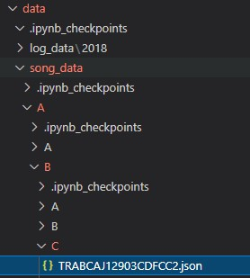
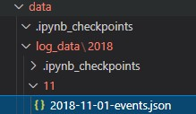
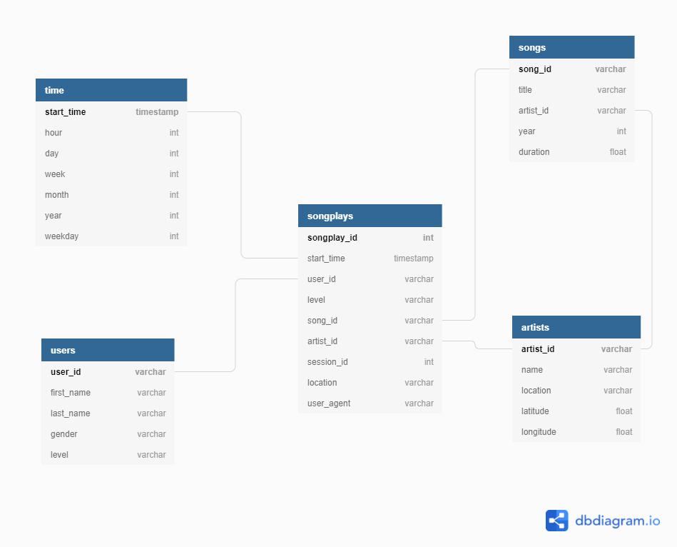

# Data Engineering Nanodegree Program

## Data Modeling with Postgres

### 1. Project scope

A startup called Sparkify have a music streaming app and they want to 
analyse their data to understand their users preferences and behaviours
using SQL queries. In order to make these analysis, they need to structure
their JSON log data and JSON song metadata in a relational database optimized
to the songplay analysis' queries. As a Data Engineer, I was assigned to
solve this problem.

### 2. Data Source

Before digging into the database design and the ETL pipeline, we need to understand how the data is 
structured and stored. In this project, the data is structured in JSON and
can be easely accessed at the project files' directory. There are two repositories:
`data/song_data`, which contains the artists' and song's metadata partitioned by 
the first three letters of each song's track ID and the `data/log_data`, which 
contains activity logs from the music streaming app.

*Song data folder navigation example:*

 

*Song data file example:*

```
{
    "num_songs": 1,
    "artist_id": "ARULZCI1241B9C8611",
    "artist_latitude": null,
    "artist_longitude": null,
    "artist_location": "",
    "artist_name": "Luna Orbit Project",
    "song_id": "SOSWKAV12AB018FC91",
    "title": "Midnight Star",
    "duration": 335.51628,
    "year": 0
}
```

*Log data folder navigation example:*



*Single log example from a log data file:*

```
{
    "artist": null,
    "auth": "Logged Out",
    "firstName": null,
    "gender": null,
    "itemInSession": 0,
    "lastName": null,
    "length": null,
    "level": "free",
    "location": null,
    "method": "PUT",
    "page": "Login",
    "registration": null,
    "sessionId": 52,
    "song": null,
    "status": 307,
    "ts": 1541207073796,
    "userAgent": null,
    "userId": ""
}
```

### 3. Database model

Since we already understand the problem, it's time to work on the solution.
The first step was choosing a relational database schema that would fit 
the needs of the company. Since we needed a model optimized to specific
and simple queries, the chosen schema was the star schema with the songplays
log data as a fact table and the users, songs, artists and time data as
dimension tables. With the `create_tables.py` script, I drop the tables,
if they exists in *sparkfydb* and then create the tables that follows 
the below diagram:



### 4. ETL Pipeline

In order to achieve the relational structure from the JSON data, I had to
build an ETL pipeline. The general idea of the `etl.py` was to access the
JSON files containing the data, convert it in a pandas dataframe, choose 
the columns we needed and, for each dataframe row and insert in the correct
table. 


To the songs and artists tables, I used the *song_data* directory 
files and for the time, users and songplays tables, I used the *log_data* 
directory. It is important to note that the insert statements for the songs,
artists and time tables have an `ON CONFLICT DO NOTHING` clause, while the 
users table have an `ON CONFLICT DO UPDATE` clause; this difference occurs 
because the only information that can possibly change, is the user's data.

### 5. Project Files

Some files were already mentioned in the previous sections,but I will list
here again to those who want a quick summary.

- `data`: folder containing the `song_data` and `log_data` JSON files;
- `create_tables.py`: python script that creates the *sparkfydb* database and it's tables;
- `etl.ipynb`: ipython notebook that walks through each step of the ETL process for the purpose
of prototyping and testing;
- `etl.py`: python script that run through all the data files, load's them into a dataframe
and insert into the respective tables;
- `sql_queries.py`: python script that contains all the SQL statements used in the aforementioned files;
- `test.ipynb`: ipython notebook used to run SQL statements to verify or ensure that the codes worked correctly;
- `images`: folder containing the images used to write this README file.


To run the project, one should first run the `create_tables.py` script with
the terminal command `python create_tables.py`  and then run the `etl.py`
script with the terminal command `python etl.py`.
